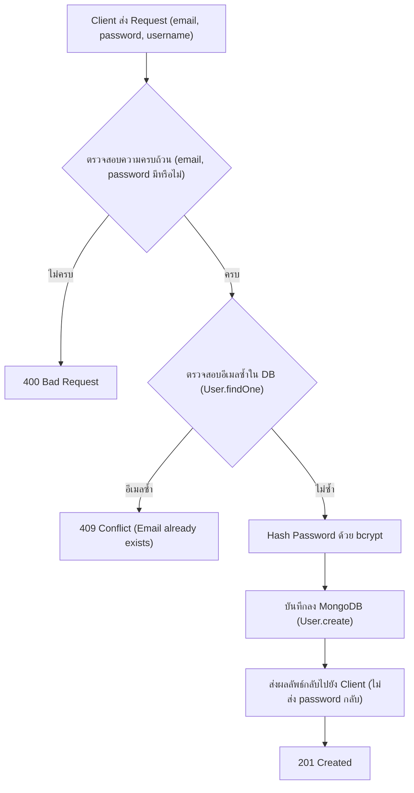

# JSD13 Week 10: Mono-Repo Express Web App

เอกสารสรุปโครงสร้างโปรเจกต์และการทำงานของ API Register (User Registration) พร้อมการแฮชรหัสผ่านด้วย bcrypt และจัดเก็บลง MongoDB รวมถึง Supabase (PostgreSQL)

---

## 1. โครงสร้างโฟลเดอร์ (Folder Structure)

โปรเจกต์นี้ใช้โครงสร้างแบบ Mono-repo:

```text
mono-repo/
├── client/                     # [Frontend] พื้นที่สำหรับฝั่ง Client
│
├── server/                     # [Backend] Express.js REST API Server
│   ├── .env                    # Environment variables (PORT, MONGODB_URI, SUPABASE_URL, etc.)
│   ├── .gitignore              # กำหนดไฟล์ที่ไม่ต้องการ push ขึ้น git
│   ├── package.json            # Dependencies และ scripts
│   ├── package-lock.json
│   │
│   ├── src/
│   │   ├── server.js           # Entry point ของแอปพลิเคชัน
│   │   │
│   │   ├── config/             # การตั้งค่าการเชื่อมต่อฐานข้อมูล
│   │   │   ├── db.js           # เชื่อมต่อ MongoDB Atlas (Mongoose)
│   │   │   └── supabase.js     # เชื่อมต่อ Supabase Client
│   │   │
│   │   ├── fakeDB/             # ข้อมูลจำลองสำหรับทดสอบ
│   │   │   └── fakeUsers.js
│   │   │
│   │   ├── models/             # Mongoose Schema & Model
│   │   │   └── user.model.js
│   │   │
│   │   └── routes/             # Modular Routing
│   │       ├── index.js        # Root router (/api/v1, /api/v2)
│   │       ├── v1/             # API v1 (In-Memory Array)
│   │       │   ├── index.js
│   │       │   └── users.routes.js
│   │       └── v2/             # API v2 (Database)
│   │           ├── index.js
│   │           ├── users.routes.js          # MongoDB CRUD + Register
│   │           └── users.supabase.routes.js # Supabase PostgreSQL CRUD
│   │
│   ├── users-api-test.rest     # ทดสอบ API v1
│   ├── users-api-test-v2.rest  # ทดสอบ API v2 (MongoDB)
│   └── users-api-test-v2-pg.rest # ทดสอบ API v2 (Supabase)
│
└── README.md
```

---

## 2. API Register & Password Hashing (bcrypt)

### 2.1 ทำไมต้อง Hash Password
การจัดเก็บรหัสผ่านลงฐานข้อมูลต้องไม่เก็บเป็น Plaintext เพื่อความปลอดภัยของผู้ใช้เมื่อฐานข้อมูลถูกเข้าถึงโดยไม่ได้รับอนุญาต จึงต้องแฮชด้วย One-way Hashing function เช่น bcrypt ก่อนบันทึกเสมอ

### 2.2 ฟังก์ชัน hashPassword
```javascript
import bcrypt from "bcrypt";

// hash password helper
export async function hashPassword(password) {
  console.log(`Raw Password : ${password}`);
  const saltRounds = 10;
  const hash = await bcrypt.hash(password, saltRounds);
  console.log(`Hashed Password from Function : ${hash}`);
  return hash;
}
```
* **saltRounds**: จำนวนรอบในการคำนวณ salt ยิ่งมากยิ่งปลอดภัยแต่ใช้เวลาประมวลผลเพิ่มขึ้น ค่ามาตรฐานทั่วไปคือ 10

---

## 3. การทำงานของ Register Endpoint (`POST /api/v2/users/register`)



### โค้ดใน src/routes/v2/users.routes.js
```javascript
// Register user
router.post("/register", async (req, res, next) => {
  try {
    const { username, email, password } = req.body;

    if (!email || !password) {
      return res
        .status(400)
        .json({ error: "email and password are required!" });
    }

    const existingUser = await User.findOne({ email });
    if (existingUser) {
      return res.status(409).json({ error: "Email already exists!" });
    }

    const hashedPassword = await hashPassword(password);
    const finalUsername = username || email.split("@")[0];

    const newUser = await User.create({
      username: finalUsername,
      email,
      password: hashedPassword,
    });

    const { password: _password, ...userWithoutPassword } = newUser.toObject();
    return res.status(201).json({
      message: "User registered successfully!",
      user: userWithoutPassword,
    });
  } catch (err) {
    next(err);
  }
});
```

---

## 4. สรุป API Endpoints

| Method | Endpoint | รายละเอียด | Database / Storage |
| :--- | :--- | :--- | :--- |
| **GET** | `/` | หน้าต้อนรับ Matrix Canvas | Express Server |
| **GET** | `/api/v1/users` | ดึงข้อมูลผู้ใช้ทั้งหมด | In-Memory (`fakeUsers.js`) |
| **POST** | `/api/v1/users` | สร้างผู้ใช้ใหม่ | In-Memory (`fakeUsers.js`) |
| **PUT** | `/api/v1/users/:id` | แก้ไขข้อมูลผู้ใช้ | In-Memory (`fakeUsers.js`) |
| **DELETE** | `/api/v1/users/:id` | ลบผู้ใช้ | In-Memory (`fakeUsers.js`) |
| **GET** | `/api/v2/users` | ดึงข้อมูลผู้ใช้ทั้งหมด | MongoDB Atlas |
| **POST** | `/api/v2/users/register` | สมัครสมาชิก (Hash Password ด้วย bcrypt) | MongoDB Atlas |
| **POST** | `/api/v2/auth/register` | สมัครสมาชิก (Auth route alias) | MongoDB Atlas |
| **POST** | `/api/v2/users` | สร้างผู้ใช้ | MongoDB Atlas |
| **PUT** | `/api/v2/users/:id` | แก้ไขข้อมูลผู้ใช้ | MongoDB Atlas |
| **DELETE** | `/api/v2/users/:id` | ลบผู้ใช้ตาม ID | MongoDB Atlas |
| **GET** | `/api/v2/users/pg` | ดึงข้อมูลผู้ใช้ทั้งหมด | Supabase (PostgreSQL) |
| **POST** | `/api/v2/users/pg` | สร้างผู้ใช้ใหม่ | Supabase (PostgreSQL) |
| **PUT** | `/api/v2/users/pg/:id` | แก้ไขข้อมูลผู้ใช้ | Supabase (PostgreSQL) |
| **DELETE** | `/api/v2/users/pg/:id` | ลบผู้ใช้ | Supabase (PostgreSQL) |

---

## 5. การทดสอบด้วย REST Client

เปิดไฟล์ `server/users-api-test-v2.rest`:

```http
### Register a new user in MongoDB
POST http://localhost:3001/api/v2/users/register
Content-Type: application/json

{
  "username": "WichayaAuth",
  "email": "wichaya_auth@example.com",
  "password": "samplepassword123"
}
```

### ผลลัพธ์ Response (201 Created):
```json
{
  "message": "User registered successfully!",
  "user": {
    "_id": "66df870f...",
    "username": "WichayaAuth",
    "email": "wichaya_auth@example.com",
    "createdAt": "2026-09-09T17:15:00.000Z",
    "updatedAt": "2026-09-09T17:15:00.000Z",
    "__v": 0
  }
}
```
